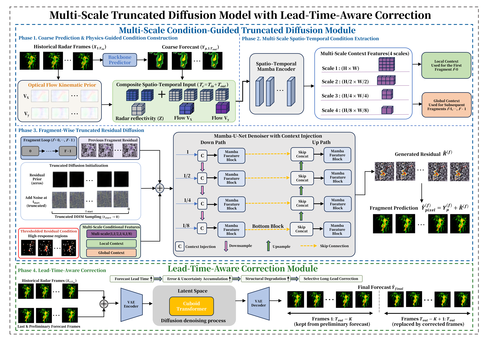
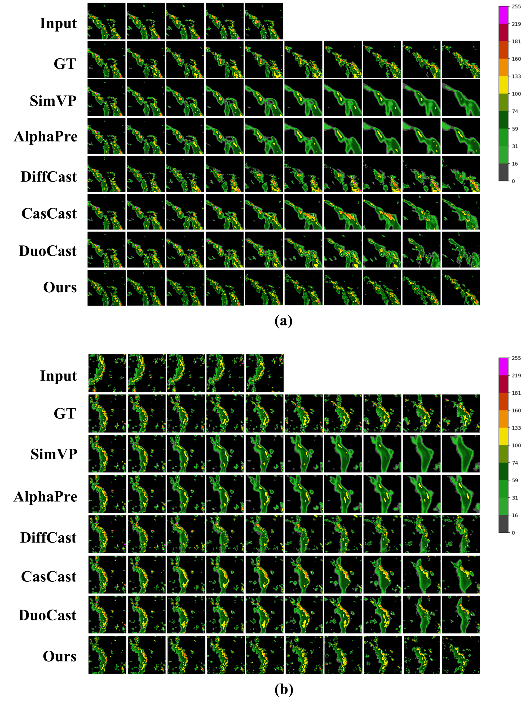
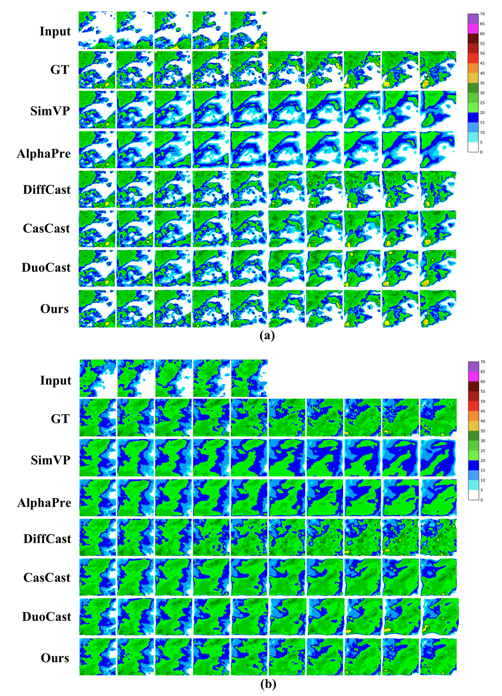

# A Multi-Scale Truncated Diffusion Model with Lead-Time-Aware Correction for Precipitation Nowcasting

**Hui Zheng, Chenxu Chu, Shuping He, Yuanda Wang, Zhi Gao, Xuexing Qiu, Xinming Zhang, and Tong Xu**

> Manuscript submitted to **IEEE Transactions on Artificial Intelligence**.

---

## Abstract

Precipitation nowcasting aims to forecast the spatio-temporal distribution of rainfall over the subsequent 0–2 hours using historical observations.

We propose a **multi-scale truncated diffusion model with lead-time-aware correction** for precipitation nowcasting. The framework incorporates optical-flow displacement fields as kinematic priors to provide explicit motion guidance, a multi-scale condition-guided truncated diffusion module to model large-scale precipitation evolution and fine-scale local details, and a lead-time-aware correction module to selectively refine long-lead forecasts.

Experiments on the **SEVIR**, **CIKM**, and **Wannan Mountain Radar** datasets demonstrate strong forecasting performance across categorical and structural evaluation metrics.

---

## Overview

Existing intelligent precipitation nowcasting methods still face several challenges:

- Lack of explicit physical guidance for precipitation motion;
- Insufficient modeling of multi-scale precipitation dynamics;
- Accumulated forecast errors and structural degradation at longer lead times.

To address these issues, our framework contains three key designs:

1. **Optical-Flow Kinematic Prior**  
   Optical-flow displacement fields are introduced as explicit motion guidance for precipitation advection.

2. **Multi-Scale Condition-Guided Truncated Diffusion**  
   Multi-scale spatio-temporal features are used to jointly model large-scale precipitation evolution and fine-scale local structures.

3. **Lead-Time-Aware Correction**  
   Long-lead forecasts are selectively refined to reduce accumulated errors and structural degradation.

---

## Framework

The proposed framework consists of two main components:

- **Multi-Scale Condition-Guided Truncated Diffusion Module**
- **Lead-Time-Aware Correction Module**

The overall forecasting process contains four phases:

1. Coarse prediction and physics-guided condition construction;
2. Multi-scale spatio-temporal condition extraction;
3. Fragment-wise truncated residual diffusion;
4. Lead-time-aware correction.

  

  <b>Overall framework of the proposed multi-scale truncated diffusion model with lead-time-aware correction.</b>

---

## Datasets

We evaluate the proposed method on three precipitation nowcasting datasets:

- **SEVIR**
- **CIKM AnalytiCup 2017 Radar Dataset**
- **Wannan Mountain Radar Dataset**

The Wannan Mountain Radar dataset is constructed for precipitation nowcasting over complex mountainous regions.

---

## Quantitative Results

| Dataset | CSI-M ↑ | HSS ↑ | SSIM ↑ |
|---|---:|---:|---:|
| SEVIR | **0.3385** | **0.4326** | **0.6935** |
| CIKM | **0.3525** | **0.4452** | **0.6806** |
| Wannan Mountain Radar | **0.2740** | **0.3916** | **0.5898** |

---

## Qualitative Results

### SEVIR

  

Qualitative comparison on representative SEVIR cases. Our method better preserves precipitation structures, localized high-intensity regions, and spatial continuity, particularly at longer forecast lead times.

### CIKM

  

Qualitative comparison on representative CIKM cases. Our method maintains precipitation distributions closer to the ground truth while preserving local echo structures and high-intensity regions.

---

## Code

The source code is currently being organized and will be released in this repository.

---

## Paper

The manuscript has been submitted to **IEEE Transactions on Artificial Intelligence**.

The complete manuscript is not publicly released in this repository at this stage.

---

## Citation

Citation information will be updated after publication.

---

## Contact

For questions regarding this work, please contact the authors.
